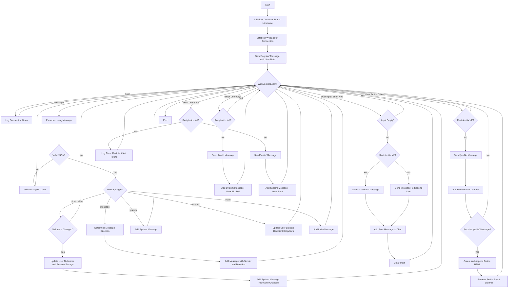

```mermaid
graph TD
    A[Start] --> B[Initialize: Get User ID and Nickname]
    B --> C[Establish WebSocket Connection]
    C --> D[Send 'register' Message with User Data]
    D --> E{WebSocket Event?}
    
    E -->|Open| F[Log Connection Open]
    F --> E
    
    E -->|Message| G[Parse Incoming Message]
    G --> H{Valid JSON?}
    H -->|No| I[Add Message to Chat]
    I --> E
    H -->|Yes| J{Message Type?}
    
    J -->|nick-confirm| K{Nickname Changed?}
    K -->|Yes| L[Update User Nickname and Session Storage]
    L --> M[Add System Message: Nickname Changed]
    M --> E
    K -->|No| E
    
    J -->|message| N[Determine Message Direction]
    N --> O[Add Message with Sender and Direction]
    O --> E
    
    J -->|system| P[Add System Message]
    P --> E
    
    J -->|userlist| Q[Update User List and Recipient Dropdown]
    Q --> E
    
    J -->|invite| R[Add Invite Message]
    R --> E
    
    E -->|User Input: Enter Key| S{Input Empty?}
    S -->|Yes| E
    S -->|No| T{Recipient is 'all'?}
    T -->|Yes| U[Send 'broadcast' Message]
    U --> V[Add Sent Message to Chat]
    V --> W[Clear Input]
    W --> E
    T -->|No| X[Send 'message' to Specific User]
    X --> V
    
    E -->|Block User Click| Y{Recipient is 'all'?}
    Y -->|Yes| E
    Y -->|No| Z[Send 'block' Message]
    Z --> AA[Add System Message: User Blocked]
    AA --> E
    
    E -->|Invite User Click| AB{Recipient is 'all'?}
    AB -->|Yes| AC[Log Error: Recipient Not Found]
    AC --> E
    AB -->|No| AD[Send 'invite' Message]
    AD --> AE[Add System Message: Invite Sent]
    AE --> E
    
    E -->|View Profile Click| AF{Recipient is 'all'?}
    AF -->|Yes| E
    AF -->|No| AG[Send 'profile' Message]
    AG --> AH[Add Profile Event Listener]
    AH --> AI{Receive 'profile' Message?}
    AI -->|Yes| AJ[Create and Append Profile HTML]
    AJ --> AK[Remove Profile Event Listener]
    AK --> E
    AI -->|No| E
    
    E --> AL[End]
```
