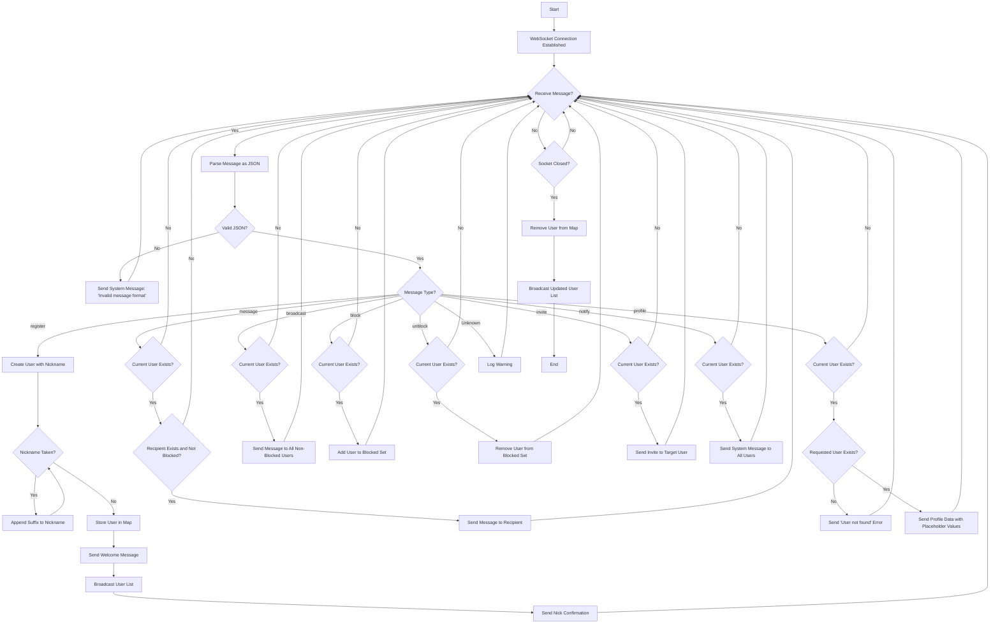

```mermaid
graph TD
    A[Start] --> B[WebSocket Connection Established]
    B --> C{Receive Message?}
    C -->|Yes| D[Parse Message as JSON]
    C -->|No| Z{Socket Closed?}
    D --> E{Valid JSON?}
    E -->|No| F[Send System Message: 'Invalid message format']
    F --> C
    E -->|Yes| G{Message Type?}
    
    G -->|register| H[Create User with Nickname]
    H --> I{Nickname Taken?}
    I -->|Yes| J[Append Suffix to Nickname]
    J --> I
    I -->|No| K[Store User in Map]
    K --> L[Send Welcome Message]
    L --> M[Broadcast User List]
    M --> N[Send Nick Confirmation]
    N --> C
    
    G -->|message| O{Current User Exists?}
    O -->|No| C
    O -->|Yes| P{Recipient Exists and Not Blocked?}
    P -->|No| C
    P -->|Yes| Q[Send Message to Recipient]
    Q --> C
    
    G -->|broadcast| R{Current User Exists?}
    R -->|No| C
    R -->|Yes| S[Send Message to All Non-Blocked Users]
    S --> C
    
    G -->|block| T{Current User Exists?}
    T -->|No| C
    T -->|Yes| U[Add User to Blocked Set]
    U --> C
    
    G -->|unblock| V{Current User Exists?}
    V -->|No| C
    V -->|Yes| W[Remove User from Blocked Set]
    W --> C
    
    G -->|invite| X{Current User Exists?}
    X -->|No| C
    X -->|Yes| Y[Send Invite to Target User]
    Y --> C
    
    G -->|notify| AA{Current User Exists?}
    AA -->|No| C
    AA -->|Yes| AB[Send System Message to All Users]
    AB --> C
    
    G -->|profile| AC{Current User Exists?}
    AC -->|No| C
    AC -->|Yes| AD{Requested User Exists?}
    AD -->|No| AE[Send 'User not found' Error]
    AD -->|Yes| AF[Send Profile Data with Placeholder Values]
    AE --> C
    AF --> C
    
    G -->|Unknown| AG[Log Warning]
    AG --> C
    
    Z -->|Yes| AH[Remove User from Map]
    AH --> AI[Broadcast Updated User List]
    AI --> AJ[End]
    Z -->|No| C
```
